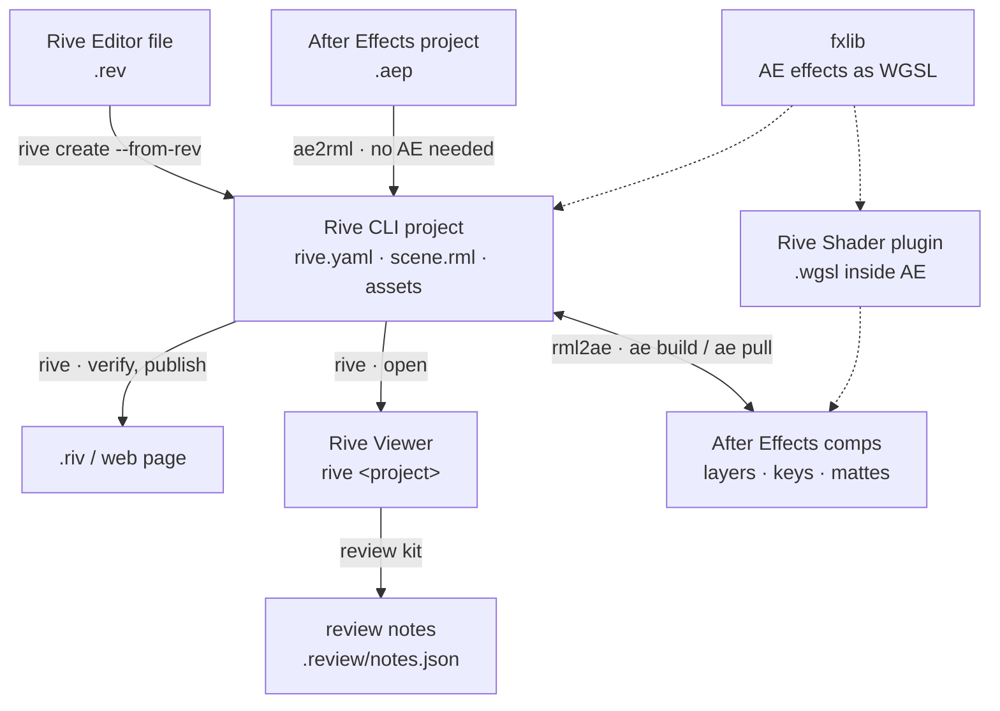

# AE RML via CLI Rive

[](https://github.com/mysteropodes/ae-rml-rive-cli/actions/workflows/ci.yml)

Round-trip between **Adobe After Effects** and **Rive**, driven from the command line through the
[Rive CLI](https://rive.app) text format (`scene.rml`):

- **ae2rml** — an After Effects project (`.aep`) becomes a Rive CLI project, without After Effects (the `.aep` is read
  by [py-aep](https://github.com/forticheprod/py-aep)).
- **rml2ae** — a Rive CLI project becomes an After Effects project (one comp per artboard, real keys, shape layers,
  text, mattes), rebuilt incrementally; edits made in AE come back with `ae pull`. A file from the **Rive Editor**
  (`.rev`) goes to After Effects the same way, once the Rive CLI has turned it into a project (`rive create --from-rev`).
- **Rive Shader** — an After Effects effect plugin that runs a Rive post-process shader (`.wgsl`) as is.
- **fxlib** — native After Effects effects re-implemented in WGSL and measured against AE renders, so that effects
  survive the trip both ways.
- **review kit** — Frame.io-like review inside the **Rive Viewer** (`rive <project>`, the Rive CLI's viewer): timeline,
  scrub, drawn and typed notes.



## Install (macOS)

```bash
git clone https://github.com/mysteropodes/ae-rml-rive-cli.git && cd ae-rml-rive-cli
./install.sh                      # everything
./install.sh rml2ae ae2rml        # or only some parts: rml2ae  ae2rml  review-kit  plugin  skills
```

- The **Rive CLI is not part of this repository**: the installer gets it from Rive (Homebrew tap `rive-app/tap`, or
  `releases.rive.app` with its sha256 checked).
- Python 3.9+ (a `.venv` is created at the root). Without the installer: `pip install -e ".[ae2rml]"` gives the
  `ae`, `ae2rml` and `rml2ae` commands (see [docs/install.md](docs/install.md#running-without-the-installer)).
- After Effects 2024+ for rml2ae and the plugin.
- The plugin is built from source and needs the free Adobe After Effects SDK (see `rml2ae/plugin/README.md`). It is
  not signed with an Apple Developer ID: macOS asks you to allow it once (System Settings › Privacy & Security).

## Use

```bash
# After Effects -> Rive (no After Effects needed)
.venv/bin/python -m rml2ae.ae2rml examples/demo.aep out/demo --verify --shot 1 3.5
rive out/demo                                  # open it in the Rive Viewer

# Rive Editor -> After Effects: first turn the editor file into a Rive CLI project
rive create out/my_scene --from-rev=my_scene.rev

# Rive -> After Effects (After Effects open, "Allow Scripts to Write Files" on)
ae doctor out/demo
ae build out/demo                              # builds / updates the comps in the open project
ae pull out/demo                               # brings AE edits (transforms, keys) back into scene.rml

# review notes in the Rive Viewer
python3 review-kit/review_install.py out/demo
```

`examples/make_demo_aep.jsx` rebuilds `examples/demo.aep` in an empty After Effects project.

## Documentation

| | |
|---|---|
| [docs/install.md](docs/install.md) | installing everything or one part |
| [docs/ae2rml.md](docs/ae2rml.md) | After Effects → Rive: options, what converts, limits |
| [docs/rml2ae.md](docs/rml2ae.md) | Rive → After Effects: the `ae` command, incremental builds, `ae pull`, limits |
| [docs/fxlib.md](docs/fxlib.md) | the WGSL library of After Effects effects and how each one is measured |
| [docs/rive-shader-plugin.md](docs/rive-shader-plugin.md) | the After Effects plugin, WGSL conventions, image meshes |
| [docs/review-kit.md](docs/review-kit.md) | review notes in the Rive Viewer |
| [docs/agents.md](docs/agents.md) | using the tools from a coding agent |

Every conversion also writes a report (`build/ae2rml/report.md`, `build/rml2ae/<name>.ae-report.md`) listing what was
converted exactly, approximated, or left out.

Known limits: After Effects' noise-based and some third-party effects have no exact equivalent; motion blur, 3D
renderers, tracking and audio mixing are not converted; Luau-scripted Rive content is replayed into After Effects as
image sequences; the plugin is not signed with an Apple Developer ID (allow it once in System Settings › Privacy &
Security). A prebuilt plugin is attached to the GitHub releases.

## Checks

GitHub Actions (Linux, no After Effects) runs on every pull request: `python -m rml2ae.tests.sim_incremental`, the
conversion of `examples/demo.aep` and `rive --verify` on the result, every fxlib effect against its After Effects
reference renders (`fxlib regress`, wgpu on the CPU, see [docs/fxlib.md](docs/fxlib.md#regression-gate-ci)), `ruff`
(errors only), and
`python3 tools/check_private.py`, which fails on local user paths (`/Users/…`, `/Volumes/…`) or e-mail addresses in
any tracked file — `.aep` files included, since After Effects stores absolute footage paths in them. Run it before
adding an example.

## Agent skills

`skills/` holds the technical skills for a coding agent (Claude Code): `rml2ae`, `ae2rml`, `rive-review-kit`.
`./install.sh skills` copies them into `~/.claude/skills`.

## Credits and licenses

MIT — see `LICENSE`. Third parties (not redistributed): Rive CLI and runtime (Rive Inc.), py-aep (Fortiche Prod, MIT),
Adobe After Effects SDK, wgpu-native — see `THIRD_PARTY.md`. This project is independent and not affiliated
with Rive Inc. or Adobe Inc.
