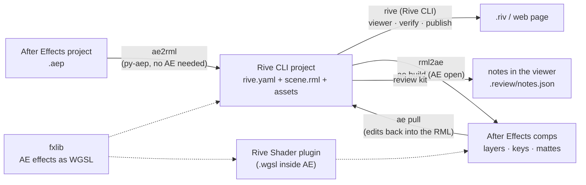

# AE RML via CLI Rive

Round-trip between **Adobe After Effects** and **Rive**, driven from the command line through the
[Rive CLI](https://rive.app) text format (`scene.rml`):

- **ae2rml** — an After Effects project (`.aep`) becomes a Rive CLI project, without After Effects (the `.aep` is read
  by [py-aep](https://github.com/forticheprod/py-aep)).
- **rml2ae** — a Rive CLI project becomes an After Effects project (one comp per artboard, real keys, shape layers,
  text, mattes), rebuilt incrementally; edits made in AE come back with `ae pull`.
- **Rive Shader** — an After Effects effect plugin that runs a Rive post-process shader (`.wgsl`) as is.
- **fxlib** — native After Effects effects re-implemented in WGSL and measured against AE renders, so that effects
  survive the trip both ways.
- **review kit** — Frame.io-like review inside the Rive CLI viewer: timeline, scrub, drawn and typed notes.



## Install (macOS)

```bash
git clone <this repository> ae-rml-rive-cli && cd ae-rml-rive-cli
./install.sh                      # everything
./install.sh rml2ae ae2rml        # or only some parts: rml2ae  ae2rml  review-kit  plugin  skills
```

- The **Rive CLI is not part of this repository**: the installer gets it from Rive (Homebrew tap `rive-app/tap`, or
  `releases.rive.app` with its sha256 checked).
- Python 3.9+ (a `.venv` is created at the root). After Effects 2024+ for rml2ae and the plugin.
- The plugin is built from source and needs the free Adobe After Effects SDK (see `rml2ae/plugin/README.md`). It is
  not signed with an Apple Developer ID: macOS asks you to allow it once (System Settings › Privacy & Security).

## Use

```bash
# After Effects -> Rive (no After Effects needed)
.venv/bin/python -m rml2ae.ae2rml examples/demo.aep out/demo --verify --shot 1 3.5
rive out/demo                                  # open it in the Rive CLI viewer

# Rive -> After Effects (After Effects open, "Allow Scripts to Write Files" on)
ae doctor out/demo
ae build out/demo                              # builds / updates the comps in the open project
ae pull out/demo                               # brings AE edits (transforms, keys) back into scene.rml

# review notes in the viewer
python3 review-kit/review_install.py out/demo
```

`examples/make_demo_aep.jsx` rebuilds `examples/demo.aep` in an empty After Effects project.

## What converts, and how well

Every conversion writes a report (`build/ae2rml/report.md`, `build/rml2ae/<name>.ae-report.md`) listing what was
converted exactly, approximated, or left out. Details, measurements and known limits:

- `rml2ae/README.md` — both converters, the effect library, the plugin (French, technical).
- `rml2ae/INSTALL.md`, `rml2ae/LLM_SETUP.md` — setup, and how to configure a coding agent.
- `review-kit/README.md` — the review kit.

Known limits (also in the reports): After Effects' noise-based and some third-party effects have no exact
equivalent; motion blur, 3D renderers, tracking and audio mixing are not converted; Luau-scripted Rive content is
replayed into After Effects as image sequences.

## Agent skills

`skills/` holds the technical skills for a coding agent (Claude Code): `rml2ae`, `ae2rml`, `rive-review-kit`.
`./install.sh skills` copies them into `~/.claude/skills`.

## Credits and licenses

MIT — see `LICENSE`. Third parties (not redistributed): Rive CLI and runtime (Rive Inc.), py-aep (Fortiche Prod, MIT),
Adobe After Effects SDK, wgpu-native — see `rml2ae/THIRD_PARTY.md`. This project is independent and not affiliated
with Rive Inc. or Adobe Inc.
